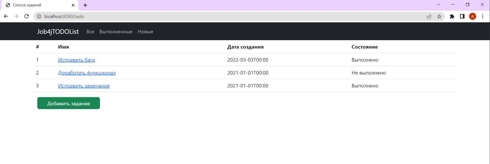
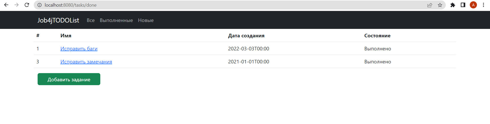
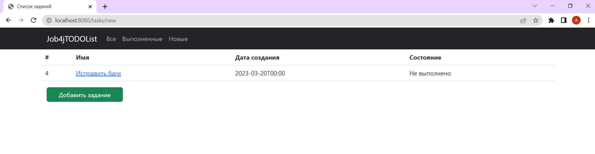
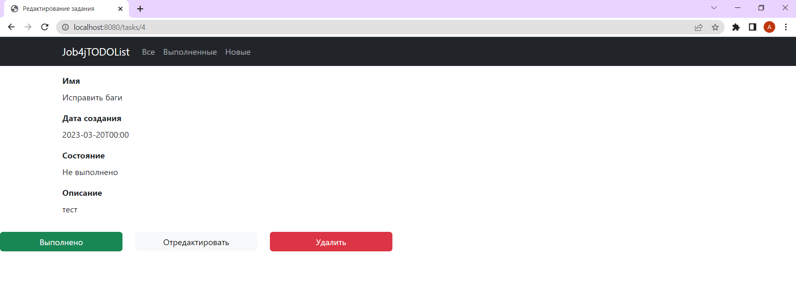
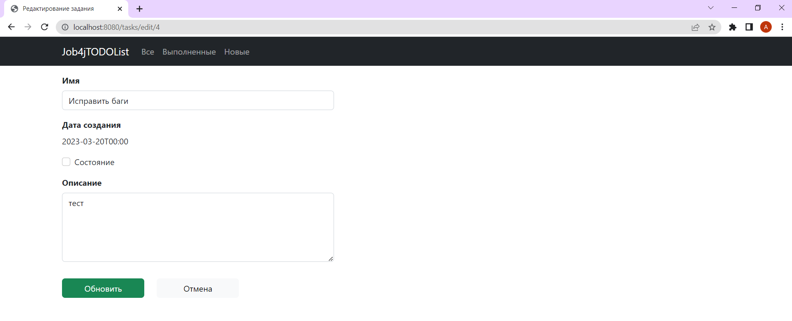
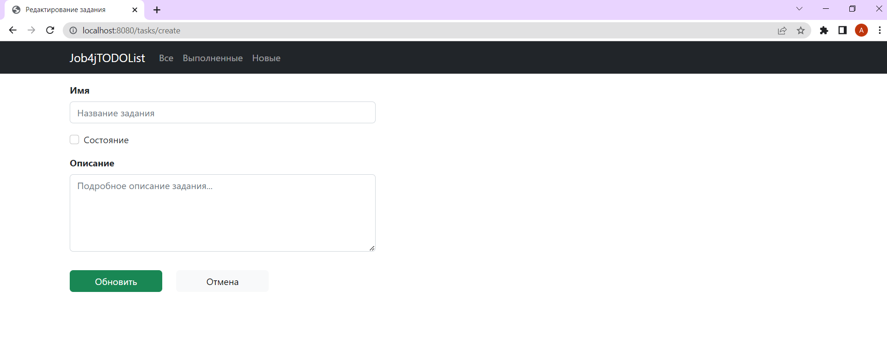
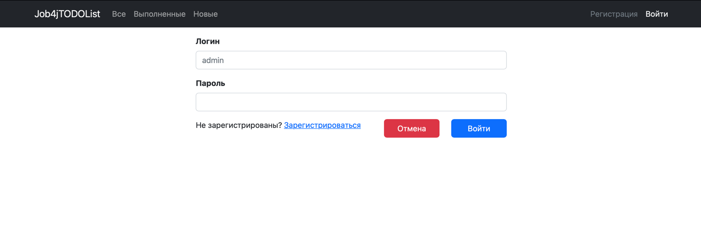
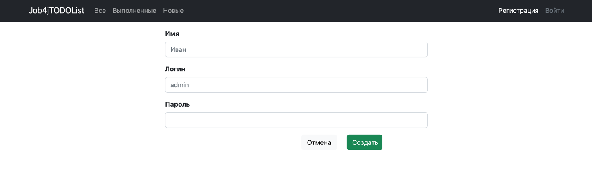

# job4j_todo

**Проект "TODO список"** - это простое веб-приложение, которое позволяет отслеживать список задач. 
Задачи имеют название, краткое описание и статус - выполнено/не выполнено.
Пользователь может отметить задачу как выполненную, и приступить к выполнению следующих задач. 
Помимо этого, есть возможность в любой момент отредактировать задачу, если это будте необходимо.

**В проекте используется следующий стек технологий:**
- Spring boot 
- Thymeleaf 
- Bootstrap 
- Hibernate 
- PostgreSql

**Для запуска проекта, необходимо наличие следующего ПО:**  
- Java 17
- Maven 3.8
- PostgreSQL 14

**Запус проекта:**
- Создать БД todo

```
create database cinema
```

- Создать таблицу tasks

```
CREATE TABLE tasks (
id SERIAL PRIMARY KEY,
name TEXT,
description TEXT,
created TIMESTAMP,
done BOOLEAN
);
```

- Запустить проект через класс Main, либо с помощью команд: 
```
javac Main.java
```

затем

```
java Main
```

**Страницы:**
- Список задач

- Выполнененные

- Новые (отображаются задачи, добавленные за последнюю неделю)

- Детальная информация по задаче

- Редактирование задачи

- Добавление задачи

- Вход

- Регистрация
